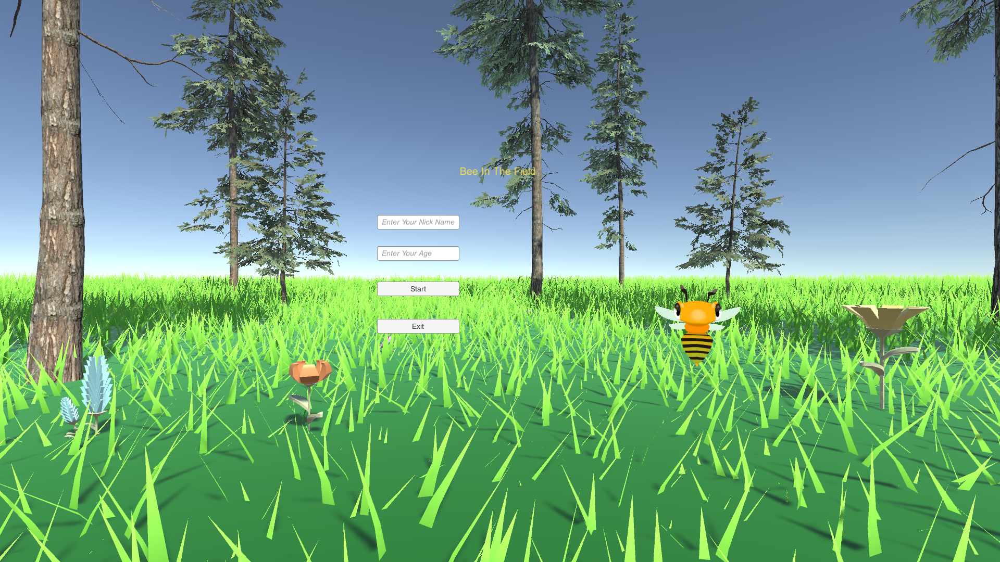
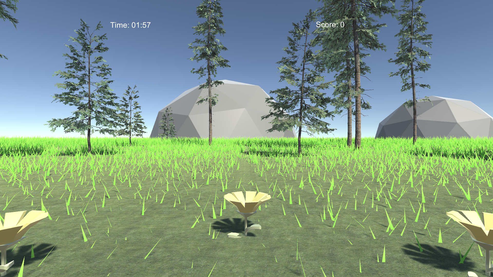
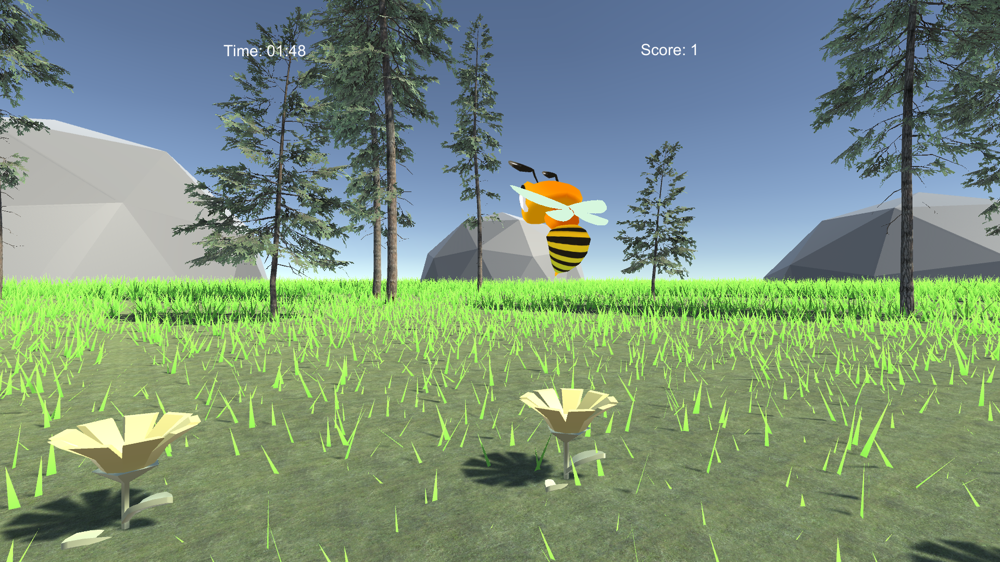

# Bee_In_The_Field Spatial hearing test and measurement game.

## Background.

This project aims to develop a more child-friendly way to train the spatial hearing ability.

## Project details.
#
This project is working with another project named Fox_Frenzy, this game is for test the accuracy of spatial hearing.
## How to run the game.
#
The playable games are in folder GameForWindows, if want to modify the game in Unity engine, the version of Unity is: 2020.3.32f1, please make sure using the same version of editor.

## Play instructions.
#

There are seven fixed position flowers, a buzzing bee in hid in one of these flowers, players have to listen and allocate which flower the bee is in,
and click the flower to find the bee.

## Game Preview

#

When lanuch the game, the start menu will appear to allow player input their name and age, also the empty input is not allowed, if input empty, a prompt word will appear to allow the player input again

After clicking the Continue button, the game begins!!!

Here's the initial game scene.

And here's the bee pop up scene.

## Play environment.
#

This game is designed for touch screen, all test works are done on DELL P2418HT, the move instructs all finger gestrues, using one finger to drag to move the view angle, then using one finger to click the screen to find the bee.

## Materials used.

#

Lowpoly Flowers [Link](https://assetstore.unity.com/packages/p/lowpoly-flowers-47083)  
Free Low Poly Pack [Link](https://assetstore.unity.com/packages/3d/free-low-poly-pack-65375)
Fantasy Bee [Link](https://assetstore.unity.com/packages/3d/characters/animals/fantasy-bee-135487)
Dynamic Grass FX [Link](https://assetstore.unity.com/packages/vfx/shaders/directx-11/dynamic-grass-fx-144740)

## The Fox_Frenzy

#

You can find another game named Fox_Frenzy [Fox](https://github.com/jeff-Tianfeng/Fox_Frenzy), which is another spatial hearing test tool.
